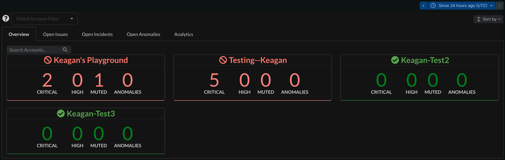
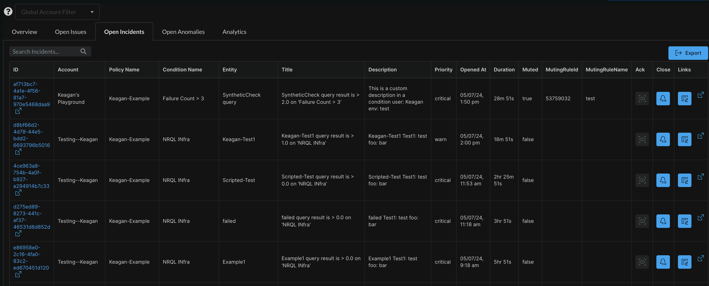
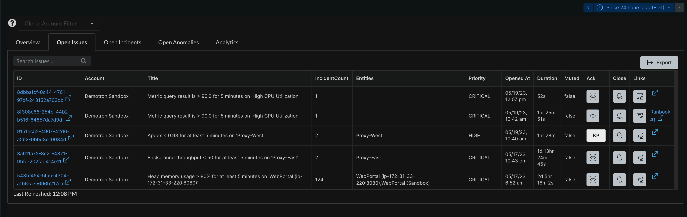
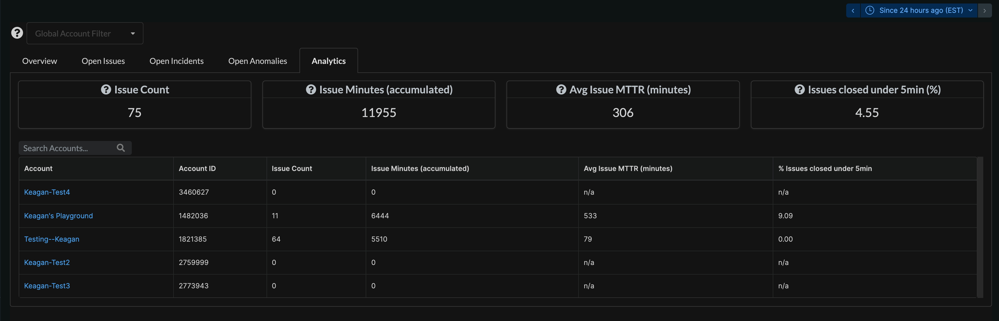
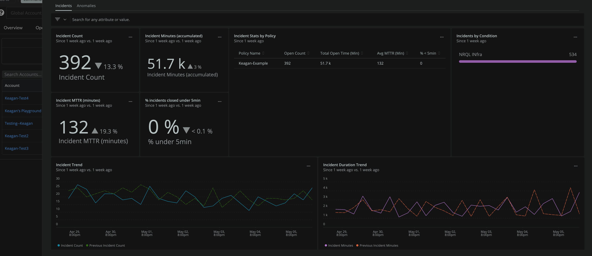

[](https://opensource.newrelic.com/oss-category/#new-relic-experimental)

[](https://snyk.io/test/github/newrelic-experimental/nr1-command-center)

# Command Center (nr1-command-center-v2)

## Usage

This application aggregates incidents, anomalies, and issues across many accounts to provide a single, operational/reliability view. It also provides analytics in order to improve alert conditions and anomalies configured.

## Features
- Per account snapshot of issue/anomaly counts
- Holistic, filterable/exportable view of open incidents, issues, and anomalies across many accounts.
- Auto refresh configuration of open incidents, issues, and anomalies
- Persistent links to correlate with individual incidents and issues
- Acknowledge and close issues/incidents directly in list view
- Analytics for total issue count, accumulated issue minutes, MTTR, and % of issues closed under 5 minutes.
- Configurable linked dashboard that can be used as a tool for operational/reliability reviews. [Template provided here - this can be added to all accounts](dashboards/ops_template.json)

## Screenshots







## Getting Started
First, ensure that you have [Git](https://git-scm.com/book/en/v2/Getting-Started-Installing-Git) and [NPM](https://www.npmjs.com/get-npm) installed. If you're unsure whether you have one or both of them installed, run the following command(s) (If you have them installed these commands will return a version number, if not, the commands won't be recognized):

```bash
git --version
npm -v
```

Next, install the [NR1 CLI](https://one.newrelic.com/launcher/developer-center.launcher) by going to [this link](https://one.newrelic.com/launcher/developer-center.launcher) and following the instructions (5 minutes or less) to install and setup your New Relic development environment.

Next, clone this repository and update `config.json` with your accountId (**NOTE: This should match the profile you are serving to**). To run the code locally against your New Relic data, execute the following commands:

```bash
nr1 nerdpack:clone -r https://github.com/newrelic-experimental/nr1-command-center-v2.git
cd nr1-command-center-v2
nr1 nerdpack:serve
```

Visit [https://one.newrelic.com/?nerdpacks=local](https://one.newrelic.com/?nerdpacks=local), navigate to the Nerdpack, and :sparkles:

## Configuration
Update `config.json` located under `./nerdlets/` with your accountId, refreshRate (in milliseconds), and optional template dashboard name that will be linked to each account (if it exists in that account) within the Analytics tab. The refreshRate variable controls how often the Open* pages are refreshed automatically.

## Deploying this Nerdpack

Open a command prompt in the nerdpack's directory and run the following commands.

```bash
# To create a new uuid for the nerdpack so that you can deploy it to your account:
# nr1 nerdpack:uuid -g [--profile=your_profile_name]

# To see a list of API keys / profiles available in your development environment:
# nr1 profiles:list

nr1 nerdpack:publish [--profile=your_profile_name]
nr1 nerdpack:deploy [-c [DEV|BETA|STABLE]] [--profile=your_profile_name]
nr1 nerdpack:subscribe [-c [DEV|BETA|STABLE]] [--profile=your_profile_name]
```

Visit [https://one.newrelic.com](https://one.newrelic.com), navigate to the Nerdpack, and :sparkles:

## Issues / Enhancement Requests

Issues and enhancement requests can be submitted in the [Issues tab of this repository](https://github.com/newrelic-experimental/nr1-command-center-v2/issues). Please search for and review the existing open issues before submitting a new issue.

## Contributing

We encourage your contributions to improve Command Center! Keep in mind when you submit your pull request, you'll need to sign the CLA via the click-through using CLA-Assistant. You only have to sign the CLA one time per project.
If you have any questions, or to execute our corporate CLA, required if your contribution is on behalf of a company,  please drop us an email at opensource@newrelic.com.

**A note about vulnerabilities**

As noted in our [security policy](../../security/policy), New Relic is committed to the privacy and security of our customers and their data. We believe that providing coordinated disclosure by security researchers and engaging with the security community are important means to achieve our security goals.

If you believe you have found a security vulnerability in this project or any of New Relic's products or websites, we welcome and greatly appreciate you reporting it to New Relic through [HackerOne](https://hackerone.com/newrelic).

## License
Command Center is licensed under the [Apache 2.0](http://apache.org/licenses/LICENSE-2.0.txt) License.
